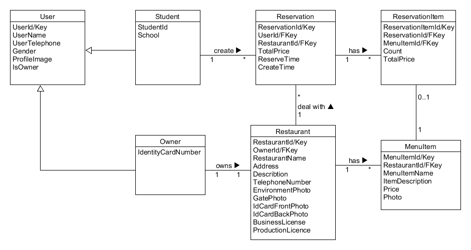

<h3>数据库设计</h3>

表名：User（顾客）

表头：

| 属性 | UserId | UserName | UserTelephone | Gender | ProfileImage(头像) | IsOwner(是否是商家) | StudentId（学号） | School | IdentityCardNumber(身份证号) |
| ---- | ------ | -------- | ------------- | ------ | ------------------ | ------------------- | ----------------- | ------ | ---------------------------- |
| 类型 | string | string   | string        | number | string             | boolean             | string            | number | string                       |

相关说明：

​	Gender用数字来代表性别，0代表未知，1代表男，2代表女

​	School用数组下标来代表学校，所以只保存下标

​	图片在数据库中存储的逻辑：

​				首先将图片upload到云“存储”，拿到fileID，然后将fileID存储到数据库中对应的属性下。

​				想要在前端显示存储在云“存储”中的图片，只需将文件Id(不是图片存储路径)赋给image的src属性。

​	存在的问题：

​				一个学校可能有多个食堂，

​				创建商家那里要添加一个选择学校的按钮

​				学校选择器我们提前做好，竟可能包括所有大学，数据库中只保存学校数组下标。

表名：Reservation(订单)

表头：

| 属性 | ReservationId | UserId(顾客ID) | RestaurantId | TotalPrice(总金额) | ReserveTime(预定取餐时间) | CreatTime(订单创建时间) |
| ---- | ------------- | -------------- | ------------ | ------------------ | ------------------------- | ----------------------- |
| 类型 | string        | string         | string       | number             | date                      | date                    |

相关问题：大家可以在这里写上开发过程中遇到的相关问题，或者解决办法，供大家学习

表名：Restaurant(食堂)

表头：

| 属性 | RestaurantID | OwenId(其实就是UserID) | RestaurantName | Address | Description | TelephoneNumber | SchoolID | isReviewed |
| ---- | ------------ | ---------------------- | -------------- | ------- | ----------- | --------------- | --------- | ---------- |
| 类型 | string       | string                 | string         | string  | string      | number          | string | boolean |
 
Restaurant续

| EnvironmentPhoto(店内环境照片) | GatePhoto（门脸图照片） | IdCardFrontPhoto(身份证正面照) | IdCardBackPhoto(身份证背面照) | BusinessLicense(营业执照) | ProductionLicence(生产许可) |
| ------------------------------ | ----------------------- | ------------------------------ | ----------------------------- | ------------------------- | --------------------------- |
| string                         | string                  | string                         | string                        | string                    | string                      |

相关问题：大家可以在这里写上开发过程中遇到的相关问题，或者解决办法，供大家学习

表名：ReservationItem（订单项）

表头：

| 属性 | ResvertionItemId | ReservationId（订单Id） | MenuItemId(菜品Id) | count(彩品数量) | TotalPrice(总金额) |
| ---- | ---------------- | ----------------------- | ------------------ | --------------- | ------------------ |
| 类型 | string           | string                  | string             | number          | number             |

相关问题：大家可以在这里写上开发过程中遇到的相关问题，或者解决办法，供大家学习

表名：MenuItem(菜品)

表头：

| 属性 | MenuItemId | RestaurantId(食堂Id) | MenuItemName(菜名) | ItemDescription | Price  | photo(菜品图片) | Class(菜品类别) |
| ---- | ---------- | -------------------- | ------------------ | --------------- | ------ | --------------- | ------------ |
| 类型 | string     | string               | string             | string          | number | string          | string |

相关问题：大家可以在这里写上开发过程中遇到的相关问题，或者解决办法，供大家学习

表名: School

表头:

| 属性 | SchoolId(Key) | SchoolName |
| ---- | ------------- | ---------- |
| 类型 | string | string |

​			
