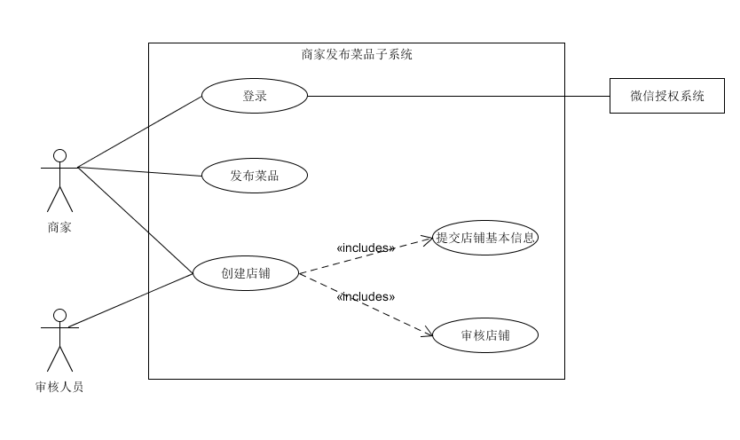
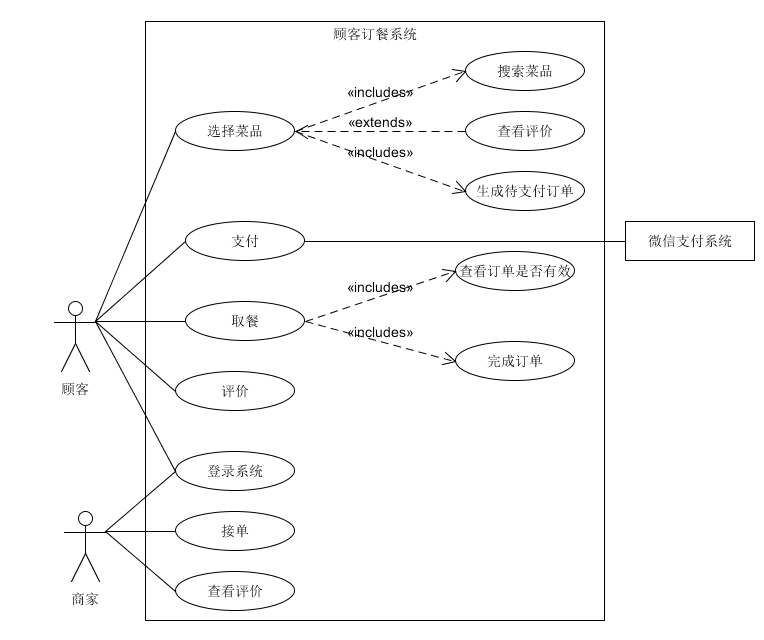

### 用例图

### 用例描述

### Fully Use Case

**用例名称**：商家创建店铺并发布菜品

**级别：** 用户目标

**主要参与者**：商家，后台审核人员

**涉众及关注点**：

- 商家：
  - 操作简便，能够方便的修改店铺信息和菜品信息；
  - 方便管理菜品，可以对菜品进行分类管理；
  - 设定菜品数量，当达到数量上限时顾客无法预定该菜品；
- 后台审核人员：
  - 操作简便，可以选择通过或者不通过店铺审核。
  - 若不通过需要有不通过的理由。
  - 有新的审核时，能够收到邮件或短信通知。

**前置条件**：

- 商家必须有线下店铺以及经营许可证
- 商家法定代表人必须有用于证明自己身份的材料，例如，身份证、护照等

**成功保证：**将最终的店铺信息及菜品信息以合理的方式存储到数据库中。

**主成功场景**：

- 1.商家使用微信授权登录系统

- 2.商家选择创建店铺，系统提示创建店铺的前置条件。商家选择继续，输入店铺名、店铺图片、店铺地址、联系电话、联系人、身份证件号码及照片、经营许可证提交给系统，商家界面显示：”等待审核“

- 3.系统自动为店铺生成一个代表该店铺的id和相关信息一起存入数据库，等待审核。
- 4.系统自动识别+人工审核，店铺创建通过。

- 5.商家进入到自己店铺，选择添加菜品。
- 6.商家输入菜品名、菜品图片、价格、规格及描述并提交菜品。
- 7.系统为该菜品生成一个Id,并存储在数据库中。发布菜品

**扩展或替代流程**：

- *a. 商家在任意时刻退出系统
  - 将当前状态保存下来
  - 在下次进入系统后，商家可以通过选择，从上次退出的地方继续。
- 1a.若微信授权失败
  - 可以直接进入系统
  - 在需要发布菜品，或者订餐时，事先检查是否处于已登录状态，若不是，进行微信授权登录。
- 2a.因某些原因提交失败。
  - 界面提示商家提交失败，并将相关数据保存在本地。
  - 提示商家重新提交。
- 3a.要注意Id的唯一性
- 4a.如果审核未通过
  - 首先将商家状态改为审核未通过，并附上未通过理由。
  - 要求商家修改相关条目并重新提交。
- 6a.因某些原因提交失败。
  - 界面提示商家提交失败，并将相关数据保存在本地。
  - 提示商家重新提交。

**特殊需求**：

- 暂无。

**技术与数据变元表**：

- 使用机器学习方法识别商家提交的材料，实现自动审核。

**发生频率**：

- 较高。

**未解决问题**：

- 图像识别算法。

### 用例图

### 用例描述

### Fully Use Case

**用例名称**：顾客订餐

**级别**：用户目标

**主要参与者**：顾客，商家

**涉众及关注点**：

- 顾客：
  - 可以直接搜索自己喜欢的饭菜；
  - 可以通过饭菜界面进入到对应商家店铺界面·；
  - 能够及时看到自己预定的饭菜的准备情况；
  - 能够添加备注；
- 商家：
  - 可以及时收到饭菜被预定的通知信息；
  - 能够打印小票；
  - 能够方便的管理订单；

**前置条件**：

- 顾客已登录到系统，且基本信息齐全（主要指联系电话)

**成功保证**：

- 每次产生的订单要永久保存。

**主成功场景**：

- 1.用户登录系统，系统显示用户登录成功
- 2.用户选择菜品及数量，并提交订单。
- 3.系统查找相应菜品，确保其有条件提供给用户，生成一个待支付订单反馈给用户。
- 4.用户进行支付。
- 5.系统收到支付，并创建一个完整订单，等待商家接单。
- 6.商家接单，并开始做相应菜品。系统给用户一个预定成功的反馈。
- 7.用户到对应商家窗口展示取餐码，并取餐。
- 8.系统收到用户取餐信息，订单完成。
- 9.用户评价所选菜品。

**扩展或替代流程**：

- 1a.如果用户登录失败，可以进行以下两个操作
  - 跳过登录，直接进入首页，可以浏览菜单。
  - 重新登录。
- 2a.如果用户在选择菜品还未提交，中途退出
  - 保存用户当前的状态，在下次用户进入选踩界面时，恢复上次选的结果。
- 3a.如果用户选择的菜品已经卖完了
  - 向用户反馈菜品已卖完，选择其它菜品。
- 6a.如果商家超过一定时间任然没有接单。
  - 系统提示顾客，下单失败，并退回顾客支付的费用，同时更新商家信用信息。
- 7a.如果用户超过一定时间仍然没有取餐
  - 取消订单，不退回用户支付的费用。

**特殊需求**：

​	暂无。

**技术与数据变元表**：

- 微信二维码生成。

**发生频率**：

**未解决问题**：

- 如何让系统打印出PDF格式的小票。